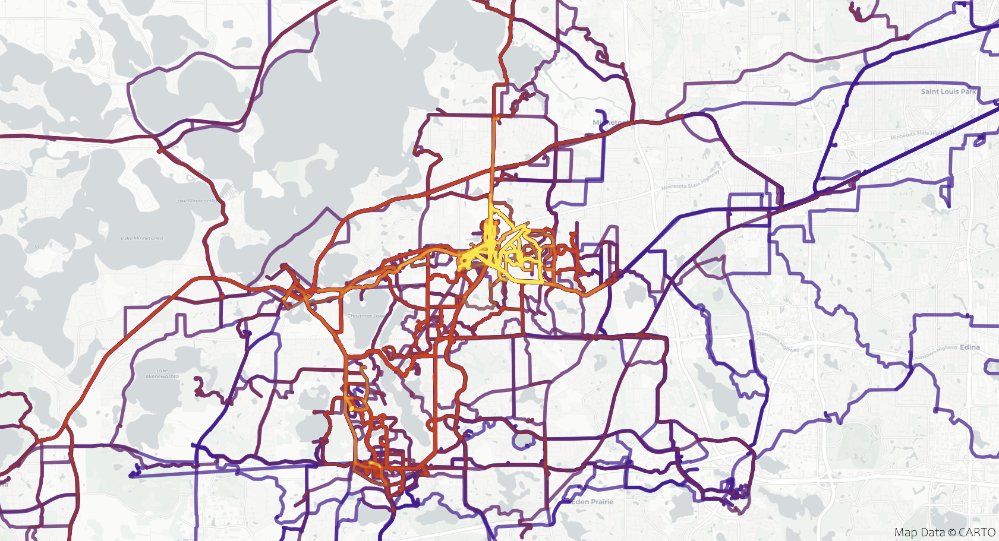

# Summary

fastgeotoolkit is a high-performance library for GPS track analysis that introduces a segment-based approach to route density mapping. Unlike traditional point-based heatmap algorithms, fastgeotoolkit processes GPS tracks as connected line segments to identify overlapping route usage patterns without the spatial clustering artifacts common in existing solutions.

The implementation handles common GPS data formats (GPX, FIT files, and Google polylines) and provides comprehensive track processing capabilities including data validation and statistics.

# Statement of Need

GPS route density visualization is important for the logistics industry, urban planning, trail management, and fitness applications. However, existing approaches have significant limitations:

**Point-based methods create misleading results**: Traditional heatmap algorithms treat GPS tracks as collections of points, using circular density kernels that poorly represent linear features like roads and trails [@Xu2024Dec]. This approach creates artificial hotspots where GPS devices record more frequent updates, regardless of actual route usage.

GPS devices record data at different frequencies depending on device settings, battery optimization, and signal conditions [@Muller2022Apr]. Point-based methods amplify these inconsistencies, making it difficult to accurately compare route popularity.

## Problems with existing implementations

**Existing tools lack specialized algorithms**: Popular GIS software and libraries like QGIS, R's spatial packages, and Python's scipy focus on point data analysis [@QGIS; @SciPy; @sf; @sp]. While these tools can process GPS tracks, they don't account for the linear nature of route data, and are thus not well-suited for use cases where preserving and processing route data with linearity in mind is important.

**Commercial solutions are inaccessible**: Algorithms do exist that process route data linearly, such as those in use by Strava. However, they are largely proprietary and are generally not available for research or custom applications [@StravaProprietary]. This creates a gap for developers who need similar functionality in their own projects.

Existing algorithms used by apps like Strava also generally rely on heavy preprocessing and do not run in the browser due to performance concerns [@StravaProprietary].

# Implementation

fastgeotoolkit addresses issues with existing heatmap implementations by treating GPS tracks as sequences of connected segments rather than point clouds. This approach provides more accurate route frequency analysis, and fastgeotoolkit implements it in such a way that it enables processing millions of tracks without preprocessing or server-side infrastructure.

## Segment-Based Algorithm

fastgeotoolkit's core algorithm processes GPS tracks in three steps:

**Track segmentation**: GPS tracks are split into consecutive coordinate pairs representing individual route segments. Each segment connects two adjacent GPS points, preserving the linear structure of the original path.

**Coordinate normalization**: To handle GPS measurement noise, coordinates are snapped to a tolerance grid. This reduces minor variations from GPS accuracy limitations while maintaining route integrity with high fidelity.

**Frequency calculation**: Each segment is converted to a normalized string key for efficient storage and lookup. A hash map tracks how many times each unique segment appears across all input tracks. Each track's final frequency is the average frequency of its constituent segments.

This approach ensures route popularity reflects actual overlapping usage rather than GPS sampling artifacts. Routes that share the same path segments will have higher frequencies, while unique routes will have lower frequencies.

## Performance and Architecture

The algorithm runs in O(n×m) time where n is the number of tracks and m is the average track length. Hash map lookups provide O(1) average-case performance for frequency queries.

The core implementation is written in Rust for memory safety and performance, then compiled to WebAssembly using wasm-pack. This enables browser-native execution without server dependencies while maintaining near-native computational speed [@Rust; @wasm].

{#heatmap width="100%"}

The library is distributed as an npm package[^1] with TypeScript definitions, integrating naturally with existing JavaScript mapping libraries like Leaflet and MapLibre GL JS, allowing for its use in webapps like the above example [@leaflet; @maplibre].

# Conclusion

fastgeotoolkit provides a practical solution for GPS route analysis by focusing on segments rather than points. This approach produces more accurate route density visualizations while being accessible through standard JavaScript tooling.

The segment-based algorithm handles the inherent challenges of GPS data, especially measurement noise, variable sampling rates, and device differences, without requiring complex preprocessing. fastgeotoolkit implements this approach while remaining highly performant, which makes it largely unique in the landscape of GIS tooling for the web.

# Acknowledgements

The authors acknowledge the open-source geospatial community and the help of users who provided feedback during development.

# References

[^1]: Available at https://www.npmjs.com/package/fastgeotoolkit